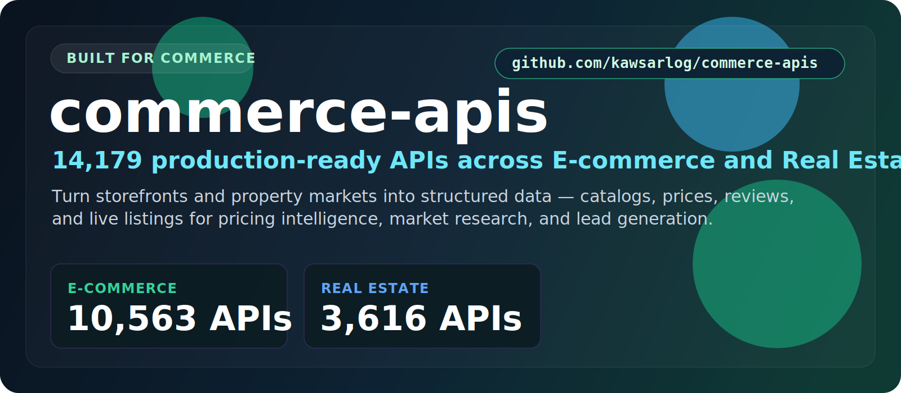

  

  <a href="#at-a-glance"><b>At a Glance</b></a> &nbsp;•&nbsp;
  <a href="#the-categories"><b>Categories</b></a> &nbsp;•&nbsp;
  <a href="#start-here"><b>Start Here</b></a> &nbsp;•&nbsp;
  <a href="#built-for"><b>Built For</b></a> &nbsp;•&nbsp;
  <a href="#why-this-repo"><b>Why This Repo</b></a>

## At a Glance

> **14,349 production-ready APIs** — production-ready APIs across E-commerce and Real Estate.

Everything you need to turn online stores and property markets into clean, structured data: product catalogs, price history, reviews, and live listings. Every API is rated, ready to plug in, and refreshed daily — built for pricing intelligence, competitive research, and lead generation.

| Metric | Value |
|--------|-------|
| **Total APIs** | **14,349** |
| **Categories** | 2 |
| **Last updated** | 2026-07-14 |
| **Update cadence** | Daily, automated |

## The Categories

<table>
  <tr>
    <td width="50%" valign="top">
      <h3>E-commerce</h3>
      
<strong>10,703 APIs</strong>

      
Product catalogs, pricing, reviews, and storefront data from major marketplaces.

      
<a href="./Ecommerce/"><strong>Open E-commerce &rarr;</strong></a>

    </td>
    <td width="50%" valign="top">
      <h3>Real Estate</h3>
      
<strong>3,646 APIs</strong>

      
Property listings, market trends, and valuation data for investment and lead gen.

      
<a href="./Real_estate/"><strong>Open Real Estate &rarr;</strong></a>

    </td>
  </tr>
</table>

## Start Here

1. Pick the category that matches what you're building.
2. Open its folder and scan the API names, ratings, and user counts.
3. Click through to the provider page for docs, pricing, and setup.
4. Shortlist in minutes — no digging through unrelated categories.

## Explore the Stack

<strong>E-commerce — 10,703 APIs</strong>

Product catalogs, pricing, reviews, and storefront data from major marketplaces.

[Browse E-commerce APIs &rarr;](./Ecommerce/)

<strong>Real Estate — 3,646 APIs</strong>

Property listings, market trends, and valuation data for investment and lead gen.

[Browse Real Estate APIs &rarr;](./Real_estate/)

## Built For

<table>
  <tr>
    <td width="25%" align="center"><strong>Price monitoring</strong></td>
    <td width="25%" align="center"><strong>Competitor tracking</strong></td>
    <td width="25%" align="center"><strong>Market research</strong></td>
    <td width="25%" align="center"><strong>Lead generation</strong></td>
  </tr>
  <tr>
    <td width="25%" align="center"><strong>Dropshipping tools</strong></td>
    <td width="25%" align="center"><strong>Property analytics</strong></td>
    <td width="25%" align="center"><strong>Investment research</strong></td>
    <td width="25%" align="center"><strong>Deal aggregators</strong></td>
  </tr>
</table>

## Why This Repo

- **Opinionated, not exhaustive.** Only the categories that matter here — no clutter.
- **Always fresh.** A scheduled job re-scrapes the source and updates the counts daily.
- **Fast to scan.** Ratings and real usage numbers surface the APIs worth your time.
- **Consistent.** Every category follows the same clean, sortable layout.

## Star History

---

**14,349 APIs** across **2 categories** — updated 2026-07-14
 If this saved you time, a star helps others find it.

